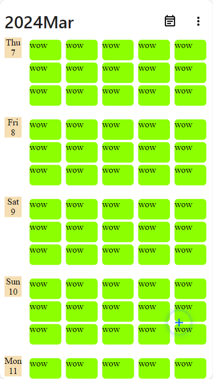

- why放弃？
  - 以小屏手机为切入点进行尝试开发，如果小屏手机空间能够适应产品形态，那基本没有问题。但是，问题出现了
  - 产品形态存在重大问题，格子无法较好的展示具体的事件时间，因为如果需要得加上大量数字表示，且每日都要写，这些数字将挤占大量空间
  - 如果优化，形态最后还是类似google calendar了，没有意义
- 收获了什么
  - dayjs的使用和iso8601时间格式的了解
  - 日历类产品形态的调研和优化思考以及对最终形态的构想

---

- 功能设计
  - 默认视图为今天开始往后的5d
    - 自定义1d的内容，因为有人凌晨3点才开始第二天
  - 图标 https://pictogrammers.com/library/mdi/?welcome
- 好久不开发,基础知识都忘了,so 必须自己弄个简单笔记
- 分享支持多选特定日子，然后分享成长截图
- key功能
  - 符合人机交互，常用按钮放在下方，比如跳转到当天&添加新的日子
  - 方便自己各种设备快速添加自己的日程
    - 设备&显示方式
      - 电脑大屏web
      - 电脑半屏web
      - 电脑edge侧边web
      - 手机全屏web
      - 平板全屏web
      - 平板小窗web
      - 平板半屏（分屏）web
    - 日程点击跳转当日todo(通常不限时，只要当日完成的事情)
    - 每天的事件最多两个横行
      - 太多事件怎么处理？先不处理
    - 自定义每日的起始和终止。包括有些人晚上3点才真正睡觉进入第二天
      - 可选每日起始的粒度为h
  - 方便自己对自己哪些时间是空闲的一目了然
  - 方便图片分享
  - 方便web link实时更新的分享
  - over

- 假设一个人的一天是6:00早上-12:00晚上，那么有18个小时
  - 两行，每行9个小时 or 5+5+5+3
- 假设9：00 - 6：00，那么有9小时，可以分为5+4
- 这样每个人每个设备可能调整方式不同
- so,记住设备号&账号，然后可以自定义调整一行的小时个数，没有保存选项，自动记忆，缩放即可快速调整。行高度固定，默认不可更改，后续可设计到深层的部分更改，也是绑定设备的设置